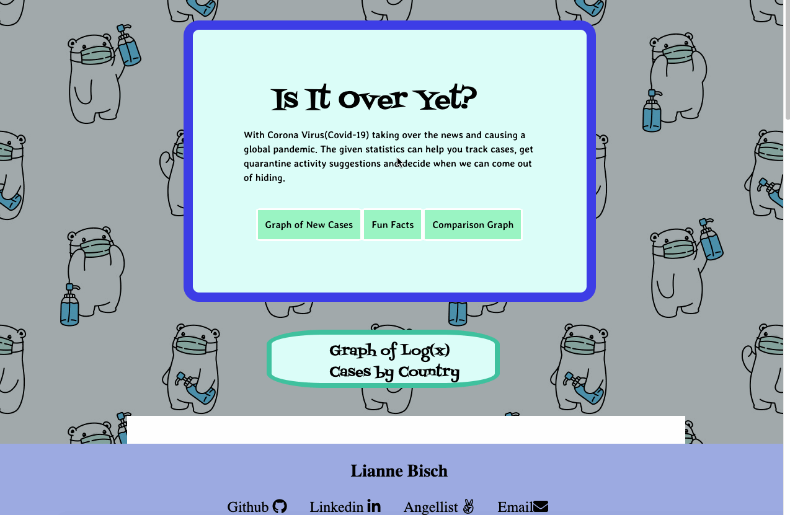

# Is It Over Yet?

[Live Link](https://celestialskyz.github.io/Javascript-Project/)

## Background and Overview
With Corona being the top story causing massive shut downs of the global economy and travel bans, I want to create a site that can track the cases with a lighthearted theme & bring some positive quarantine activities to help us all through.

## Functionality & MVPs 
-bar graph of a random selection of 8 countries’ cases cases.
-interactive and show data points.
-fun suggestions for things to do in quarantine.
-allows you to create your own graph based on chosen x and y parameters.
-double bar graph of all the cases, vs deaths, vs recoveries based on input.

## Wireframe

## API and Tech
* CORONAVIRUS COVID19 API
* D3 JS Library
* HTML 
* CSS 

## Highlighted Features
### Bar graph
The implementation of a graph that dynamically changes as the user hovers over each bar per country. 

### Double bar graph
The implementation of a graph that dynamically changes according to user input of X and Y Axes.

## Implementation Timeline
* Day 1: figure out D3 and create 1st world line graph
* Day 2: add  interactivity to graph
* Day 3: double bar graph countries based on user input
* Day 4: create form for double bar graph and make double graph interactive
* Day 5: style & make it pretty
