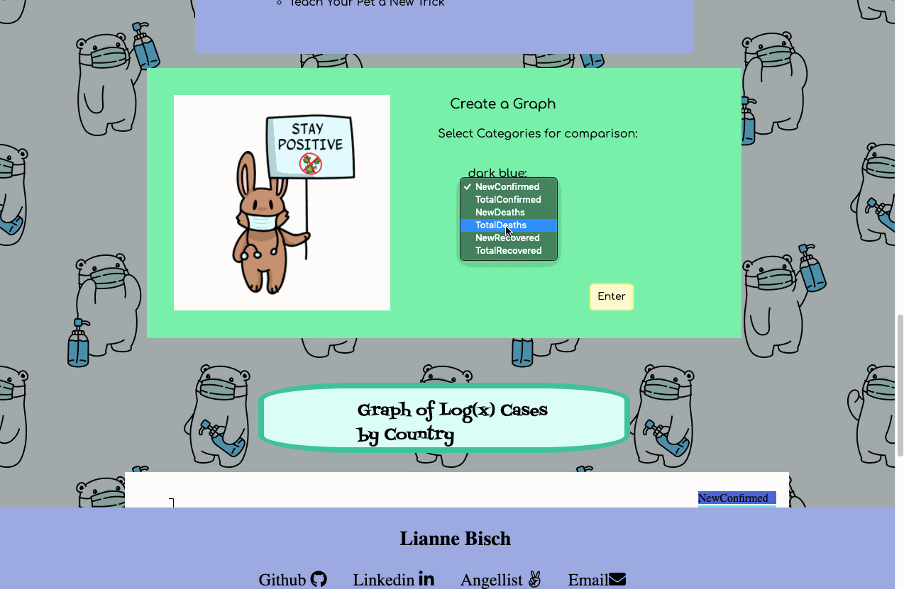

# Is It Over Yet?


[Live Link](https://celestialskyz.github.io/Javascript-Project/)

## Background and Overview
With Corona being the top story causing massive shut downs of the global economy and travel bans, I want to create a site that can track the cases with a lighthearted theme & bring some positive quarantine activities to help us all through.

## Functionality & MVPs 
- bar graph of a random selection of 8 countries’ cases cases.
- interactive and show data points.
- fun suggestions for things to do in quarantine.
- allows you to create your own graph based on chosen parameters.
- double bar graph of all the cases, vs deaths, vs recoveries based on input.
- reload image when the API is overloaded with requests

## Wireframe


## API and Tech
* CORONAVIRUS COVID19 API
* D3 JS Library
* HTML 
* CSS 

## Highlighted Features
### Bar graph
The implementation of a graph that dynamically changes as the user hovers over each bar per country. 

Upon hovering over a bar on the graph, the country whose bar it belongs to is taken in via `d`. The transition method indicates an animated change to the `DOM` and is given a transition so the bar grows smoothly. The bar itself is assigned an additional class `highlight` to allow for a change of color and is given a new width and height so that the bar grows horizontally and vertically upon hovering and stays proportional.
```
function onMouseOver(d, i){ 
      d3.select(this).attr('class', 'highlight');
      d3.select(this)
        .transition()
        .duration(500)
        .attr("width", xScale.bandwidth()+5)
        .attr("y", function(d) { return yScale(Math.log(d.NewConfirmed).toFixed(4))-10; })
        .attr("height", function(d) { return height - yScale(Math.log(d.NewConfirmed).toFixed(4)) +10; });
     //  debugger
      g.append("text")
      .attr('class', 'value')
      .attr('x', function(){return xScale(d.Country)+20})
      .attr('y', function(){return yScale(Math.log(d.NewConfirmed).toFixed(4))-15;})
      .text(function(){
        return Math.log(d.NewConfirmed).toFixed(4);
      });
    }
```
Upon Mouse Leave, the dimensions of the bar that was hovered on, are reset to their original values and the text displaying the numerical statistic the bar represents is removed.

```
 function onMouseLeave(d, i){
      d3.select(this).attr('class', 'bar');
      d3.select(this)
      .transition()
      .duration(500)
      .attr("width", xScale.bandwidth())
      .attr("y", function(d) { return yScale(Math.log(d.NewConfirmed).toFixed(4)); })
      .attr("height", function(d) { return height - yScale(Math.log(d.NewConfirmed).toFixed(4)); });
      d3.selectAll('.value')
      .remove();
    }
```
### Double bar graph
The implementation of a graph that dynamically changes according to user input of X and Y Axes.

The second graph works with two different x domains, one for the overall graph and one for the subcategories per country allowing space for two bars per country. 
```
 xScale.domain(dom.map(d=> { return d.Country;}));
  subcatsX.domain(subcatsnames).range([0, xScale.bandwidth()]);
  yScale.domain([0, d3.max(y)*1.5]);
```
The section designated for each country's bars are selected and the subcategories are extracted in order to create a bar per subcategory. Each subcategory is given a specific color to differentiate the two bars above each country. 
```
subsection.selectAll("rect")
      .data(function(c) { 
        return c.subs;})
      .enter().append("rect")
      .attr("width", subcatsX.bandwidth())
      .attr("x", function(c) {
         return subcatsX(c.name)+26;})
      .attr("y", function(c) {return yScale(c.value);})
      .attr("height", function(c){return height-yScale(c.value);})
      .style("fill", function(c){ //debugger 
        return color(c.name);});
```
On Mouse Over the position of the text is based on the graph as a whole and the position of one's mouse to determine the first subcategory bar's x coordinates `xpos` and this x is added to the x of the subcategory bar `subcatsX(d.name)` which starts at 0 if it is the first bar or the width of the first bar for the second bar. It is then given an additional 26 to center the text above its respective bar. 
```
g.append("text")
          .attr('class', 'value')
          .attr('x', ()=>{ 
            let xpos = event.target.parentElement.transform.baseVal[0].matrix.e;
            return xpos+ subcatsX(d.name)+26;
             //  return event.clientX;
          })
```
## Implementation Timeline
* Day 1: figure out D3 and create 1st world line graph
* Day 2: add  interactivity to graph
* Day 3: double bar graph countries based on user input
* Day 4: create form for double bar graph and make double graph interactive
* Day 5: style & make it pretty
